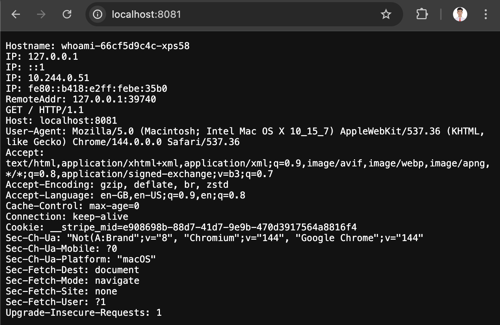

**Checkpoint A**: Students record:
* throughput (Requests/sec)
* latency (avg) and look at tail latency (P95-ish from wrk output)

```bash
Running 1m test @ http://httpbin.lab.svc.cluster.local/get
  2 threads and 50 connections
  Thread Stats   Avg      Stdev     Max   +/- Stdev
    Latency    28.37ms   36.27ms 389.01ms   80.82%
    Req/Sec     2.73k     1.25k    8.09k    65.77%
  326253 requests in 1.00m, 121.34MB read
Requests/sec:   5428.98
Transfer/sec:      2.02MB
```

**Checkpoint B:** Students explain:
* readiness = “should receive traffic?”
* liveness = “should be restarted?”

```bash
command % kubectl -n lab describe pod -l app=httpbin | grep -E "Ready:|Restart Count|State:"
    State:          Running
    Ready:          True
    Restart Count:  0
    State:          Running
    Ready:          True
    Restart Count:  0
    State:          Waiting
    Last State:     Terminated
    Ready:          False
    Restart Count:  6

command % kubectl -n kube-system get pods | grep metrics

metrics-server-5778bb4788-48t85    1/1     Running   0               3m1s

command % kubectl -n lab get hpa
NAME          REFERENCE            TARGETS       MINPODS   MAXPODS   REPLICAS   AGE
httpbin-hpa   Deployment/httpbin   cpu: 2%/60%   2         10        2          30s
```

# Before replica count

```
/ # wrk -t4 -c200 -d120s http://httpbin.lab.svc.cluster.local/get
Running 2m test @ http://httpbin.lab.svc.cluster.local/get
  4 threads and 200 connections
  Thread Stats   Avg      Stdev     Max   +/- Stdev
    Latency    55.77ms   69.26ms 700.75ms   87.86%
    Req/Sec     1.44k   727.92     4.85k    68.25%
  688647 requests in 2.00m, 256.13MB read
Requests/sec:   5734.08
Transfer/sec:      2.13MB
```

# After replica count

```
/ # wrk -t4 -c200 -d120s http://httpbin.lab.svc.cluster.local/get
Running 2m test @ http://httpbin.lab.svc.cluster.local/get
  4 threads and 200 connections
  Thread Stats   Avg      Stdev     Max   +/- Stdev
    Latency    28.70ms   34.59ms 497.56ms   79.74%
    Req/Sec     4.36k     1.34k   12.55k    68.31%
  2083653 requests in 2.00m, 774.98MB read
Requests/sec:  17350.20
Transfer/sec:      6.45MB
```

Checkpoint C — CPU load & scaling

Before scaling
Replica count = 2
P95-ish latency = ~700 ms
Throughput = 5734 req/sec

After scaling
Replica count = 10 → stabilized at 6–7
P95-ish latency = ~498 ms (improved)
Throughput = 17350 req/sec

Conclusion
HPA scaled pods under CPU load -> lower tail latency + much higher throughput

# Checkpoint D:

```bash
command kubernetes %  kubectl exec -n lab loadgen -- sh -c
'for i in $(seq 1 8); do echo "Request $i:"; curl -s http://whoami.lab.svc.clust
er.local | grep Hostname; done'
Request 1:
Hostname: whoami-66cf5d9c4c-jgvsq
Request 2:
Hostname: whoami-66cf5d9c4c-xps58
Request 3:
Hostname: whoami-66cf5d9c4c-jgvsq
Request 4:
Hostname: whoami-66cf5d9c4c-xps58
Request 5:
Hostname: whoami-66cf5d9c4c-xps58
Request 6:
Hostname: whoami-66cf5d9c4c-jgvsq
Request 7:
Hostname: whoami-66cf5d9c4c-v9clr
Request 8:
Hostname: whoami-66cf5d9c4c-jgvsq
command kubernetes %  kubectl get endpoints -n lab whoami -
o wide
Warning: v1 Endpoints is deprecated in v1.33+; use discovery.k8s.io/v1 EndpointSlice
NAME     ENDPOINTS                                      AGE
whoami   10.244.0.51:80,10.244.0.52:80,10.244.0.53:80   9m27s
```

```bash
command kubernetes % kubectl -n lab port-forward svc/whoami 8081:80
Forwarding from 127.0.0.1:8081 -> 80
Forwarding from [::1]:8081 -> 80
Handling connection for 8081
Handling connection for 8081
```

